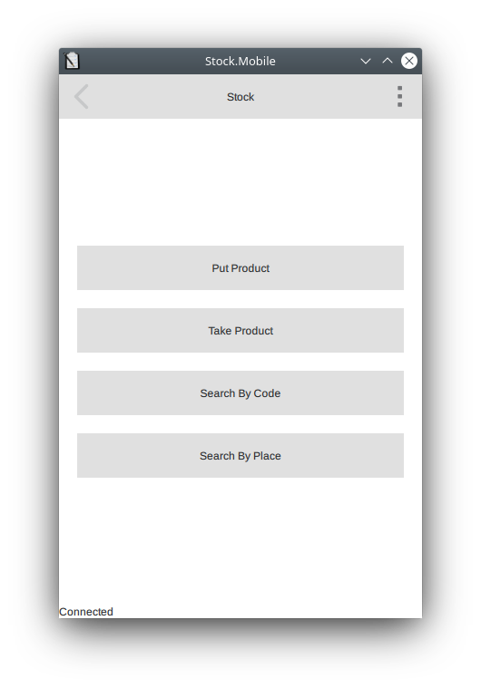

# About

Stock is a desktop and mobile applications to manage a small warehouse.

I implemented desktop and mobile parts with minimum required functionality.
This is just a pilot. If I will receive any feedback, any interest I will
continue work on this project.

In a few words about this project: desktop part is a server side application
where user can add, delete, edit products, places, descriptions, amount of products,
whereas a mobile part is for just adding/deleting product on/from place and for
searching product in the warehouse by product's code or place.

Desktop part and mobile aplication should be in one local network to connect.
When mobile application connecting to desktop part it broadcasts UDP datagram on
33663 port and server answers via UDP with its IP and port to connect via TCP.
Once mobile part receives IP and port from the server and establishes TCP
connection with the given address and port it receives hello message from the server.
And sure the server will answer only if password is correct. Once mobile app received
hello message with list of all product's codes and places in the warehouse it is
connected and can speak with the server. At this point mobile part can add or delete
some amount of the given product on the given place. And user can look for the list
of products on the given places, or find all places where the given product is placed.

Mobile part can operate only with exist product codes and places, user can't
add any new product or place to the database. So, first of all, on the server
side should be added all products and places. Add dialog in the desktop part
allow to do it without actual placing of prducts on places.

That's all. And sure on the desktop part all interactions of mobile part are shown in
real time.

But this is just a preview, just basic options are implemented...

# Getting from Repository

After clone update submodules with the next command:

```
git submodule update --init --recursive
```

# Build

Firts of all you need to build desktop part of the Stock,
after it you can build mobile part, it's very important to build
desktop part first.

To build desktop part use stock.pro in the root directory.

To build mobile part use stock/mobile/mobile.pro

# Screenshots



